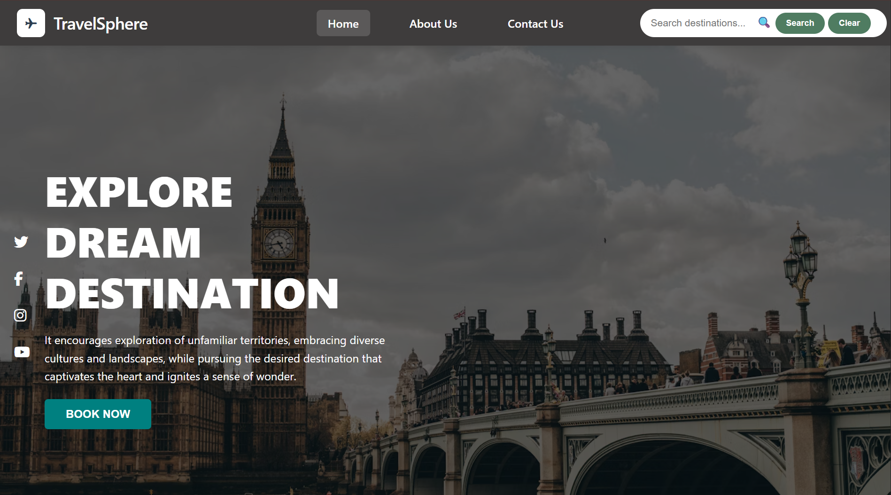

# 🌍 TravelSphere - A Travel Recommendation Website

A modern, responsive travel recommendation website that helps users discover amazing destinations around the world. Built with vanilla HTML, CSS, and JavaScript with smart search functionality and beautiful visual design.



## ✨ Features

### 🔍 Smart Search System
- **Case-insensitive search** - Works with `beach`, `Beach`, `BEACH`, etc.
- **Keyword variations** - Recognizes `beaches`, `shore`, `coastal` for beach searches
- **Multiple categories** - Search for beaches, temples, countries, and cities
- **Guaranteed results** - Minimum 2+ recommendations for each category
- **Real-time API integration** - Fetches data from travel API

### 🎨 Modern UI/UX
- **Smooth animations** and hover interactions
- **Responsive layout** - Works on desktop, tablet, and mobile
- **High-quality images** from Unsplash for each destination
- **Social media integration** with Font Awesome icons

### 📱 Interactive Features
- **Explore destination** buttons with customizable actions
- **Bookmark/Save** functionality with local storage
- **Star ratings** for destinations
- **Loading states** and error handling
- **Clear search** functionality

## 🚀 Live Demo

🌐 **[Visit TravelSphere Live](https://amson-tech.github.io/TravelSphere-a-travelRecommendation-website/index.html)**


## 📁 Project Structure

```
TravelSphere/
├── index.html    # Main HTML file (GitHub Pages entry point)
├── style.css
├── script.js
├── READM.md     #This file
├── travel_about.html                    
├── travel_contact.html                      
└── travel_recommendation_api.json                       # JSON file
```

## 🛠️ Installation & Setup

### Option 1: View Live on GitHub Pages
Simply visit the live demo link above - no installation required!

### Option 2: Run Locally for Development

1. **Clone the repository**
   ```bash
   git clone https://github.com/Amson-tECH/TravelSphere-a-travelRecommendation-website.git
   cd TravelSphere-a-travelRecommendation-website
   ```

2. **Open the project**
   - Simply open `index.html` in your web browser
   - Or use a local server (recommended for development):
   ```bash
   # Using Python
   python -m http.server 8000
   
   # Using Node.js (live-server)
   npx live-server
   
   # Using PHP
   php -S localhost:8000
   ```

3. **Access the website**
   - **Local development**: `http://localhost:8000`
   - **GitHub Pages**: `https://amson-tech.github.io/TravelSphere-a-travelRecommendation-website/`

## 📊 GitHub Pages Deployment

This project is automatically deployed using GitHub Pages:

### 🔧 Deployment Settings
- **Source**: Deploy from main branch
- **Custom Domain**: Available (optional)
- **HTTPS**: Enabled by default
- **Auto-deployment**: Updates automatically on push to main

### 🌐 Access Methods
1. **Direct URL**: `https://amson-tech.github.io/TravelSphere-a-travelRecommendation-website/`
2. **Custom Domain**: Configure in repository settings (optional)


## 🎯 How to Use

### Search Functionality
1. **Visit the live site** at the GitHub Pages URL
2. **Enter search terms** in the navigation search bar
3. **Click "Search"** or press Enter
4. **View results** with images, descriptions, and ratings
5. **Explore destinations** or save them to bookmarks

### Supported Search Keywords

| Category | Keywords | Example Results |
|----------|----------|-----------------|
| **🏖️ Beaches** | `beach`, `beaches`, `shore`, `coastal`, `sand` | Bora Bora, Copacabana Beach, Rio de Janeiro |
| **🏛️ Temples** | `temple`, `temples`, `shrine`, `monument`, `heritage` | Angkor Wat, Taj Mahal, Kyoto |
| **🌍 Countries** | `country`, `countries`, `Australia`, `Japan`, `Brazil` | Australia, Japan, Brazil + their cities |

## 🔧 Customization & Development

### Fork and Deploy Your Own Version

1. **Fork this repository** on GitHub
2. **Enable GitHub Pages** in your fork's settings
3. **Customize the code** as needed
4. **Push changes** - your site updates automatically!

### Adding New Destinations
Edit the search data in the JavaScript:

```javascript
// Add new keyword variations
const KEYWORD_VARIATIONS = {
  beaches: ['beach', 'beaches', 'your-new-keyword'],
  temples: ['temple', 'temples', 'your-new-keyword'],
  countries: ['country', 'countries', 'your-new-keyword']
};
```

### Changing Colors
Update the colors in `style.css`:

```css
/* Update these color values */
.search-btn-1 {
    background: #4f7c61;  /* Your brand color */
}

.hero {
    background: rgba(0, 0, 0, 0.6);  /* Hero overlay */
}
```


## 🔧 Customization

### Adding New Destinations
Edit the API endpoint or modify the search data in the JavaScript:

```javascript
// Add new keyword variations
const KEYWORD_VARIATIONS = {
  beaches: ['beach', 'beaches', 'your-new-keyword'],
  temples: ['temple', 'temples', 'your-new-keyword'],
  countries: ['country', 'countries', 'your-new-keyword']
};


## 🌐 API Integration

The project uses a travel API endpoint:
```
https://cf-courses-data.s3.us.cloud-object-storage.appdomain.cloud/IBMSkillsNetwork-JS0101EN-SkillsNetwork/travel1.json
```

### API Response Structure
```json
{
  "countries": [
    {
      "id": 1,
      "name": "Australia",
      "cities": [
        {
          "name": "Sydney, Australia",
          "imageUrl": "image-url.jpg",
          "description": "City description"
        }
      ]
    }
  ],
  "temples": [...],
  "beaches": [...]
}
```

## 📱 Browser Compatibility

- ✅ Chrome 90+
- ✅ Firefox 88+
- ✅ Safari 14+
- ✅ Edge 90+
- ✅ Mobile browsers

## 🤝 Contributing

### 💡 Ways to Contribute
1. **Report Bugs** - Create an issue on GitHub
2. **Suggest Features** - Open a feature request
3. **Submit Pull Requests** - Improve the code
4. **Improve Documentation** - Help others understand the project
5. **Share the Project** - Star ⭐ and share with others


## 📈 Performance & SEO

### ⚡ Optimizations
- **Image Optimization**: All images loaded from Unsplash CDN
- **Lazy Loading**: Images load on demand
- **Minification**: Consider minifying CSS/JS for production
- **Caching**: Browser caching enabled for static assets

### 🔍 SEO Features
- **Meta Tags**: Properly configured for social sharing
- **Responsive Design**: Mobile-first approach
- **Fast Loading**: Optimized assets and minimal dependencies
- **Semantic HTML**: Proper HTML structure for accessibility


## 🔒 Security & Privacy

- **HTTPS Enabled**: All GitHub Pages sites use HTTPS
- **No Personal Data**: No user data collected or stored on server
- **Local Storage Only**: Bookmarks stored locally in browser
- **External APIs**: Only trusted APIs used (IBM Skills Network)
- **No Tracking**: No analytics or tracking scripts included

## 📝 Features Roadmap

### 🎯 Planned Features
- [ ] **User Authentication** - Login/Register functionality
- [ ] **Advanced Filters** - Price, rating, duration filters
- [ ] **Booking Integration** - Connect with travel booking APIs
- [ ] **User Reviews** - Allow users to rate and review destinations
- [ ] **Trip Planning** - Create and save trip itineraries
- [ ] **Weather Integration** - Show current weather for destinations
- [ ] **Currency Converter** - Display prices in different currencies
- [ ] **Offline Mode** - PWA functionality for offline browsing
- [ ] **Dark/Light Mode** - Theme switching capability
- [ ] **Multi-language Support** - Internationalization

### 🚀 Recent Updates
- ✅ **GitHub Pages Deployment** - Live website accessible globally
- ✅ **Mobile Optimization** - Enhanced mobile experience
- ✅ **Image Integration** - High-quality destination images
- ✅ **Search Enhancement** - Smart keyword recognition
- ✅ **Interactive Features** - Bookmark and explore functionality

## 🐛 Known Issues & Solutions

### 🔧 Current Limitations
| Issue | Status | Workaround |
|-------|--------|------------|
| Images may load slowly | 🔄 Monitoring | Uses CDN for faster loading |
| Limited API data | 📝 Planned | Expanding to more travel APIs |
| Bookmark data per browser | 💡 Feature Request | Consider user accounts |
| Search limited to current data | 🔄 In Progress | Adding more destinations |

### 🆘 Troubleshooting
**Site not loading?**
- Check your internet connection
- Try clearing browser cache
- Visit: `https://yourusername.github.io/travelsphere/`

**Search not working?**
- Ensure JavaScript is enabled
- Try different search terms: `beach`, `temple`, `country`
- Check browser console for errors

**Images not displaying?**
- Images are loaded from external CDN (Unsplash)
- Check if your network blocks external images
- Fallback images should load automatically

## 🌟 Showcase & Examples

### 📸 Sample Search Results

**Search: "beach"**
```
Results Found: 3+
- 🏖️ Bora Bora, French Polynesia
- 🏖️ Copacabana Beach, Brazil  
- 🌊 Rio de Janeiro, Brazil (Coastal City)
```

**Search: "temple"**
```
Results Found: 3+
- 🏛️ Angkor Wat, Cambodia
- 🏛️ Taj Mahal, India
- 🏮 Kyoto, Japan (Historic City)
```

**Search: "country"**
```
Results Found: 3
- 🇦🇺 Australia (2 featured cities)
- 🇯🇵 Japan (2 featured cities)  
- 🇧🇷 Brazil (2 featured cities)
```


## 🙏 Acknowledgments

- **Unsplash** - High-quality destination images
- **Font Awesome** - Social media icons
- **IBM Skills Network** - Travel data API
- **Google Fonts** - Typography

## 👤 Author

**Reuben Korsi Amuzu**
- GitHub: [@Amson-tECH](https://github.com/Amson-tECH)
- Email: reubenamuzu23@gmail.com

## ⭐ Show Your Support

Give a ⭐️ if this project helped you!


**Built with ❤️ using vanilla JavaScript, CSS3, and HTML5**


